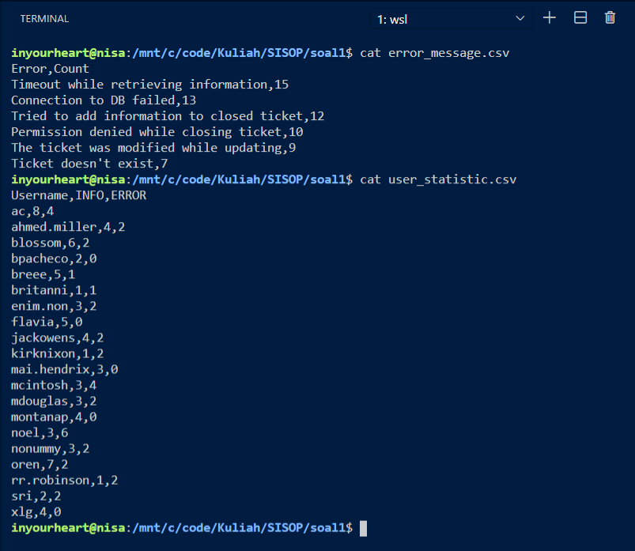
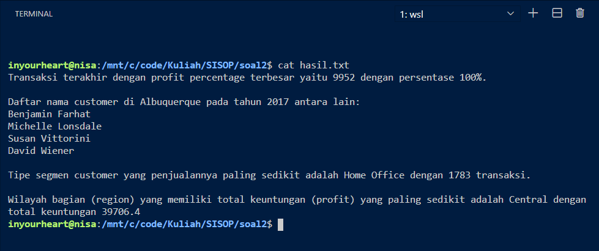
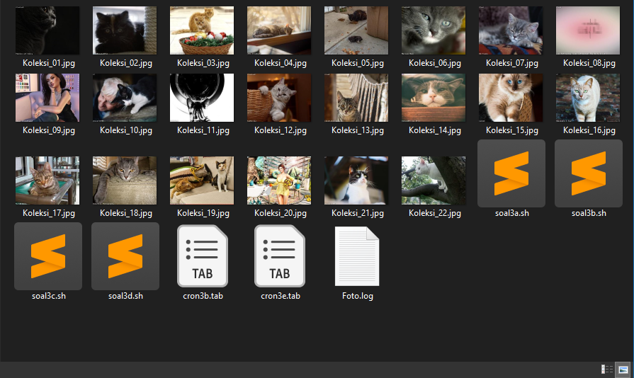
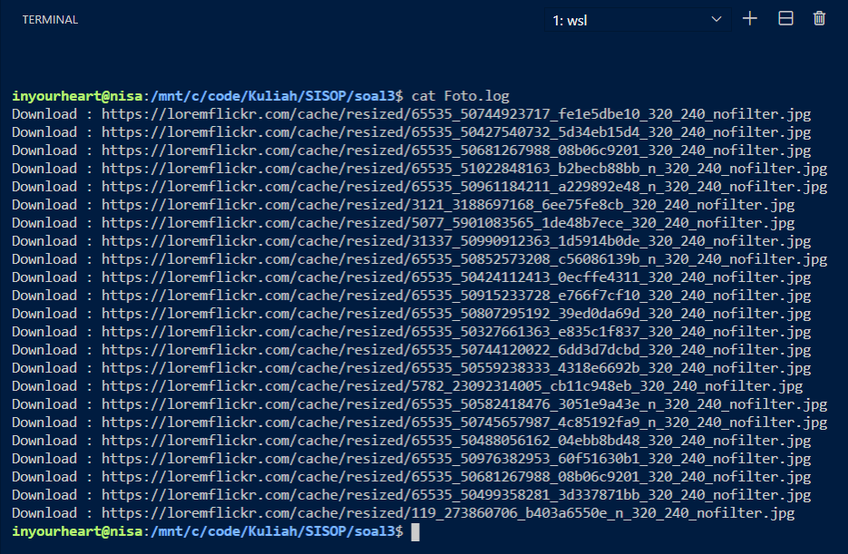
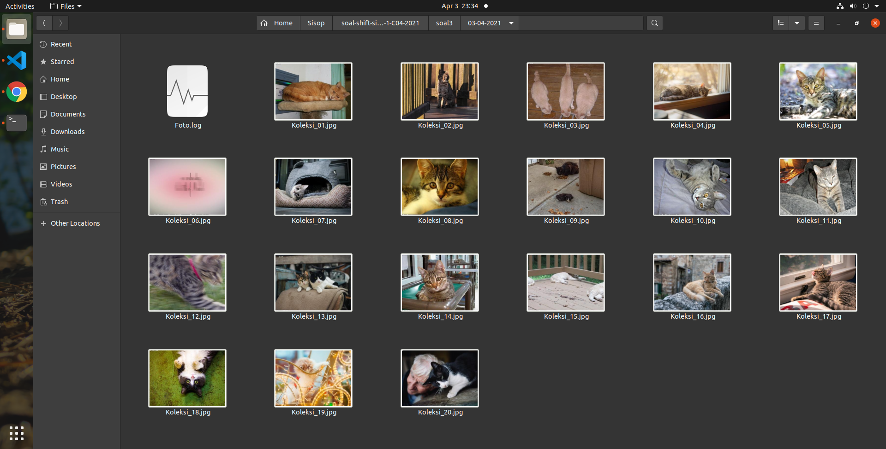
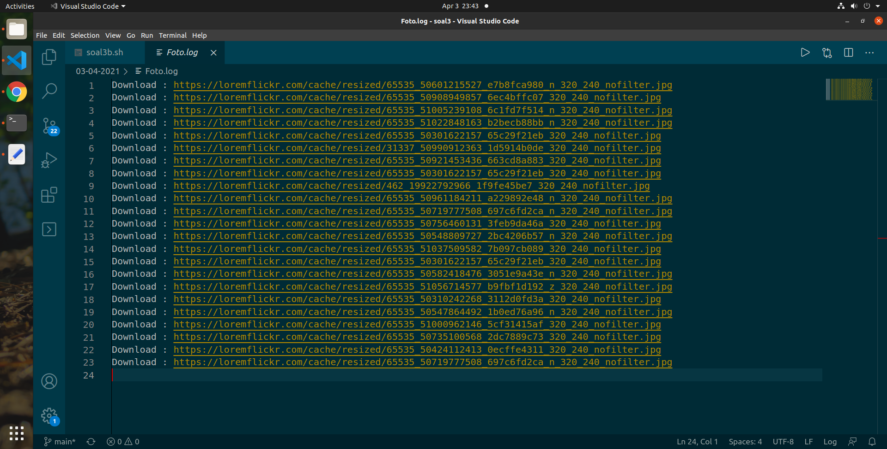
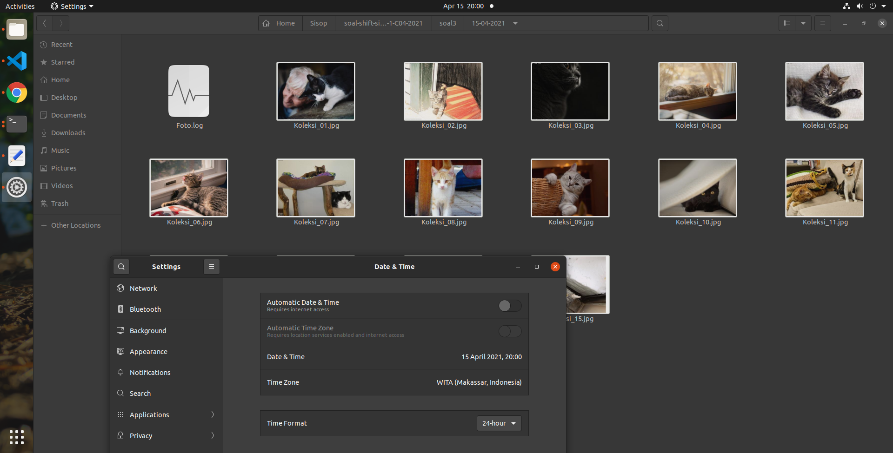
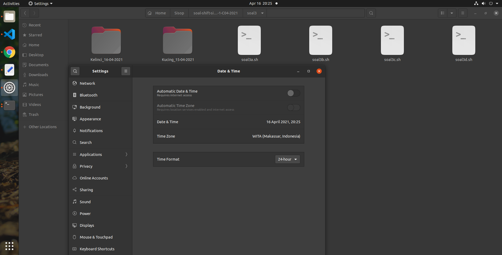

# Kelompok C04 Sistem Operasi C

- I Kadek Agus Ariesta Putra	05111940000105
- Muhammad Arif Faizin	05111940000060
- Ahmad Lamaul Farid	05111940000134

# Soal
Link soal : [Soal Shift 1](https://drive.google.com/file/d/1__Zdvng6ciRyzo43XTlxpSwXHfwk9hrS/view?usp=sharing)

## Soal 1
---
### # Narasi Soal
Ryujin baru saja diterima sebagai IT support di perusahaan Bukapedia. Dia diberikan tugas untuk membuat laporan harian untuk aplikasi internal perusahaan, ticky. Terdapat 2 laporan yang harus dia buat, yaitu laporan daftar peringkat pesan error terbanyak yang dibuat oleh ticky dan laporan penggunaan user pada aplikasi ticky. Untuk membuat laporan tersebut, Ryujin harus melakukan beberapa hal berikut

### # A
Mengumpulkan informasi dari log aplikasi yang terdapat pada file syslog.log. Informasi yang diperlukan antara lain: jenis log (ERROR/INFO), pesan log, dan username pada setiap baris lognya. Karena Ryujin merasa kesulitan jika harus memeriksa satu per satu baris secara manual, dia menggunakan regex untuk mempermudah pekerjaannya. Bantulah Ryujin membuat regex tersebut.

Statemen problem A disini adalah memberitahu praktikan bahwa solusi dari soal ini adalah menggunakan regex

### # B
Ryujin harus menampilkan semua pesan error yang muncul beserta jumlah kemunculannya.
Untuk memperoleh hal tersebut kami menggunakan 

```bash
for line in $(cat syslog.log | grep "ERROR" | grep -oP "ERROR\s\K.*(?=\s\()" | sort | uniq)
do
    total=$(cat syslog.log | grep -c "$line")
    echo $line,$total
done
```

Langkah pertama yaitu mengambil isi dari file syslog.log lalu di-'grep' untuk menampilkan baris yang memiliki string "ERROR" lalu kita 'grep' lagi untuk memperoleh *match* sesuai dengan pattern `ERROR\s\K.*(?=\s\()` yaitu string yang diawali dengan `'ERROR '` dan diakhiri dengan `' ('`. Lalu hasilnya kita urutkan dan hapus duplikatnya dengan menggunakan `sort` dan `uniq`
```bash
cat syslog.log | grep "ERROR" | grep -oP "ERROR\s\K.*(?=\s\()" | sort | uniq
```
Kemudian hasil dari kode diatas akan di looping dengan delimiter yang kita *override* `IFS=$'\n'` yang berarti looping setiap line. Untuk setiap line, kita akan menghitung banyaknya pesan error tersebut muncul dengan cara `cat syslog.log | grep -c "$line"`. Opsi -c pada `grep -c` akan memberikan output banyaknya *match* pada pattern yang kita berikan. Lalu keluarkan pesan error beserta jumlah munculnya dipisahkan dengan spasi. Dengan kode program sebagai berikut:
```bash
for line in $(cat syslog.log | grep "ERROR" | grep -oP "ERROR\s\K.*(?=\s\()" | sort | uniq)
do
    total=$(cat syslog.log | grep -c "$line")
    echo $line,$total
done
```

### # C
Ryujin juga harus dapat menampilkan jumlah kemunculan log ERROR dan INFO untuk setiap user-nya.

Langkahnya mirip dengan problem B, yaitu mencari daftar user dengan pattern `'\(\K.*(?=\))'` yang berarti *match* berada diawali dengan `'('` dan diakhiri dengan `')'` dan kita hapus juga duplikatnya, dengan kode program:
```bash
cat syslog.log | grep -oP '\(\K.*(?=\))' | sort | uniq
```
Lalu dilakukan looping untuk setiap user dan dihitung user tersebut memiliki berapa banyak error dan berapa banyak info. Cara menghitung error dan info adalah dengan mencari baris yang mengandung string user tersebut lalu di-'grep -c' untuk menghitung memiliki berapa banyak ERROR ataupun INFO. Dan keluarkan dengan format : `user,totalerror,totalinfo` Kode program adalah sebagai berikut:
```bash
for line in $(cat syslog.log | grep -o '(.*)' | tr -d '(' | tr -d ')' | sort | uniq)
do
    error=$(cat syslog.log | grep "$line" | grep -c "ERROR")
    info=$(cat syslog.log | grep "$line" | grep -c "INFO")
    echo $line,$error,$info
done
```

### # D
Semua informasi yang didapatkan pada poin b dituliskan ke dalam file error_message.csv dengan header Error,Count yang kemudian diikuti oleh daftar pesan error dan jumlah kemunculannya diurutkan berdasarkan jumlah kemunculan pesan error dari yang terbanyak.

Pertama-tama kita siapkan dulu file berisikan header "Error,Count" error_message.csv dengan:
```bash
echo "Error,Count">error_message.csv
```
Lalu melanjutkan statement B sebelumnya kita hanya tinggal mengurutkan berdasarkan jumlah kemunculan pesan error dari yang terbanyak dengan cara melanjutkan output dari perulangan B untuk diurutkan menggunakan fungsi `sort -nrk 2 -t','` dengan penjelasan masing-masing parameter adalah sebagai berikut:
```
-r, --reverse               reverse the result of comparisons
-n, --numeric-sort          compare according to string numerical value
-k, --key=KEYDEF            sort via a key; KEYDEF gives location and type
-t, --field-separator=SEP   use SEP instead of non-blank to blank transition
```
lalu hasilnya disimpan ke error_message.csv (append). Dengan implementasi sebagai berikut:
```bash
for line in $(cat syslog.log | grep "ERROR" | grep -oP "ERROR\s\K.*(?=\s\()" | sort | uniq)
do
    total=$(cat syslog.log | grep -c "$line")
    echo $line,$total
done | sort -rnk 2 -t','>>error_message.csv
```

### # E
Semua informasi yang didapatkan pada poin c dituliskan ke dalam file user_statistic.csv dengan header Username,INFO,ERROR diurutkan berdasarkan username secara ascending.

Pertama-tama kita siapkan dulu file berisikan header "Username,INFO,ERROR" user_statistic.csv dengan:
```bash
echo "Username,INFO,ERROR">user_statistic.csv
```
Lalu hanya tinggal melanjutkan dari problem #C. Karena output dari problem #C sudah urut, maka tinggal kita masukkan ke dalam user_statistic.csv (append). Implementasi sebagai berikut:
```bash
for line in $(cat syslog.log | grep -oP '\(\K.*(?=\))' | sort | uniq)
do
    total_error=$(cat syslog.log | grep "$line" | grep -c "ERROR")
    total_info=$(cat syslog.log | grep "$line" | grep -c "INFO")
    echo $line,$total_error,$total_info
done >> user_statistic.csv
```
### # Implementasi Lengkap
Source code : [soal3a.sh](https://github.com/ariestahrt/soal-shift-sisop-modul-1-C04-2021/blob/main/soal1/soal1.sh)
```bash
#!/bin/bash
IFS=$'\n'

echo "Error,Count">error_message.csv
echo "Username,INFO,ERROR">user_statistic.csv
# D

for line in $(cat syslog.log | grep "ERROR" | grep -oP "ERROR\s\K.*(?=\s\()" | sort | uniq)
do
    total=$(cat syslog.log | grep -c "$line")
    echo $line,$total
done | sort -rnk 2 -t','>>error_message.csv

# E
for line in $(cat syslog.log | grep -oP '\(\K.*(?=\))' | sort | uniq)
do
    total_error=$(cat syslog.log | grep "$line" | grep -c "ERROR")
    total_info=$(cat syslog.log | grep "$line" | grep -c "INFO")
    echo $line,$total_error,$total_info
done >> user_statistic.csv
```

### # Hasil
Isi file `error_message.csv` dan `user_statistic.csv`


## Soal 2
---
### # Narasi Soal
Steven dan Manis mendirikan sebuah startup bernama “TokoShiSop”. Sedangkan kamu dan Clemong adalah karyawan pertama dari TokoShiSop. Setelah tiga tahun bekerja, Clemong diangkat menjadi manajer penjualan TokoShiSop, sedangkan kamu menjadi kepala gudang yang mengatur keluar masuknya barang.

Tiap tahunnya, TokoShiSop mengadakan Rapat Kerja yang membahas bagaimana hasil penjualan dan strategi kedepannya yang akan diterapkan. Kamu sudah sangat menyiapkan sangat matang untuk raker tahun ini. Tetapi tiba-tiba, Steven, Manis, dan Clemong meminta kamu untuk mencari beberapa kesimpulan dari data penjualan “`Laporan-TokoShiSop.tsv`”.


### # A
Mencari Row ID dan profit percentage terbesar dari data, dengan rumus 
```
Profit Percentage = (Profit / Cost Price) * 100
```
di mana Cost Price dapat didapatkan dari pengurangan kolom Sales dengan Profit. Kemudian menyimpannya ke dalam variabel `profit_percentage`

### # B
Mencari data dengan `city` bernilai `Albuquerque` dan memeiliki `orderdate` bernilai `17`. Data tersebut disimpan ke dalam list `albuquerque17` dengan key `customer_name` diberi 1. 

### # C
Mengelompokkan dan menghitung setiap customer segment yang ada di dalam data, kemudian mencari segmen dengan jumlah transaksi paling sedikit.
Untuk setiap data, nilai dari variabel `segment` dengan key `customer_segment` akan bertambah sesuai dengan nilai kolom `customer_segment` pada baris tersebut. Seperti kode di bawah ini 
```bash
segment[customer_segment]++;
```
Kemudian untuk setiap key akan dibandingkan untuk mengetahui mana yang jumlahnya paling sedikit dari seluruh segmen
```bash
for(key in segment){
        if(segment[key] <= lowest_segment_totaltrx){
            lowest_segment_type=key;
            lowest_segment_totaltrx=segment[key];
        }
    }
```

### # D
Menghitung total profit dari setiap region kemudian mencari region dengan profit paling sedikit dan total keuntungan wilayah tersebut.
Untuk setiap data, nilai dari variabel `region_proofit` dengan key `region` akan bertambah sesuai dengan nilai kolom `region` pada baris tersebut. Seperti kode di bawah ini 
```bash
region_proofit[region]+=profit;
```
Kemudian untuk setiap key akan dibandingkan untuk mengetahui mana yang jumlahnya paling sedikit dari seluruh region

### # E
Hasil dari soal #A, #B, #C dan #D kemudian akan dicetak dalam file "hasil.txt" sesuai dengan format yang telah ditentukan.

### # Hasil
Isi file `hasil.txt`



## Soal 3
---
### # Narasi Soal
Kuuhaku adalah orang yang sangat suka mengoleksi foto-foto digital, namun Kuuhaku juga merupakan seorang yang pemalas sehingga ia tidak ingin repot-repot mencari foto, selain itu ia juga seorang pemalu, sehingga ia tidak ingin ada orang yang melihat koleksinya tersebut, sayangnya ia memiliki teman bernama Steven yang memiliki rasa kepo yang luar biasa. Kuuhaku pun memiliki ide agar Steven tidak bisa melihat koleksinya, serta untuk mempermudah hidupnya, yaitu dengan meminta bantuan kalian. Idenya adalah 

### # A
Narasi :

Membuat script untuk mengunduh 23 gambar dari "https://loremflickr.com/320/240/kitten" serta menyimpan log-nya ke file "Foto.log". Karena gambar yang diunduh acak, ada kemungkinan gambar yang sama terunduh lebih dari sekali, oleh karena itu kalian harus menghapus gambar yang sama (tidak perlu mengunduh gambar lagi untuk menggantinya). Kemudian menyimpan gambar-gambar tersebut dengan nama "Koleksi_XX" dengan nomor yang berurutan tanpa ada nomor yang hilang (contoh : Koleksi_01, Koleksi_02, ...)

Solusi :

Untuk mendownload dari "https://loremflickr.com/320/240/kitten" karena gambar yang kita download bukan langsung pada link tersebut atau dengan kata lain terjadi pengalihan/redirect ke alamat foto kucing tersebut sehingga kita memerlukan bantuan command `curl`. Untuk melihat kemana kita akan dialihkan kita perlu mengetahui response header dari http request ke "https://loremflickr.com/320/240/kitten" untuk itu kita perlu melakukan `curl -s -i "https://loremflickr.com/320/240/kitten"` dengan parameter `-s` artinya berjalan dalam silent mode (tanpa mengeluarkan statistik downloadnya) dan `-i` untuk menampilkan response headernya. Dengan contoh response header sebagai berikut:
```
HTTP/2 302
date: Sat, 27 Mar 2021 12:33:04 GMT
content-type: text/html; charset=utf-8
set-cookie: __cfduid=dae18d9e1bb3b50e78d4e2c5c5525645f1616848384; expires=Mon, 26-Apr-21 12:33:04 GMT; path=/; domain=.loremflickr.com; HttpOnly; SameSite=Lax; Secure
expires: Thu, 19 Nov 1981 08:52:00 GMT
cache-control: no-store, no-cache, must-revalidate
pragma: no-cache
access-control-allow-origin: *
set-cookie: PHPSESSID=bcfb82ad7a1e16efb611dc63cc420687; path=/
location: /cache/resized/65535_50520994638_cae73fb9cf_320_240_nofilter.jpg
cf-cache-status: DYNAMIC
cf-request-id: 09154589360000eb79e7a55000000001
expect-ct: max-age=604800, report-uri="https://report-uri.cloudflare.com/cdn-cgi/beacon/expect-ct"
report-to: {"max_age":604800,"endpoints":[{"url":"https:\/\/a.nel.cloudflare.com\/report?s=w8LgeScWo%2FuhttUA9DV5GJl8sdwOSNtbdNJRv0bLMZfRDrgaD509ZKvBZe2JWkqUR0P6YfIyqq8LIXSubTu5Yms%2BPKISvmCG9Cd8CENa0HI%3D"}],"group":"cf-nel"}
nel: {"report_to":"cf-nel","max_age":604800}
server: cloudflare
cf-ray: 6368a521efaceb79-LAX
alt-svc: h3-27=":443"; ma=86400, h3-28=":443"; ma=86400, h3-29=":443"; ma=86400
```
dari response header `location: /cache/...` dapat dikethaui ternyata kita di-redirect menuju `'/cache/resized/65535_50520994638_cae73fb9cf_320_240_nofilter.jpg'` yaitu foto yang akan di-download. Sehingga langkah pertama yang kita harus lakukan adalah mencari nilai header `location: ` tersebut dengan cara:
```bash
neko_host="https://loremflickr.com"
neko_endpoint=`curl -s -i "https://loremflickr.com/320/240/kitten" | grep "location" | awk -F ': ' '{print $2}' | tr -d '\r'`
neko_to_download="${neko_host}${neko_endpoint}"
neko_filename=`echo "$neko_endpoint" | awk -F '/' '{print $4}'`
```
dari potongan kode di atas, kita mendapatkan informasi link foto kucing yang akan di download (`neko_to_download`) dan nama filenya (`neko_filename`). Lalu kita download dengan perintah `wget` dan kita simpan bahwa kita sedang mendownload dari link tersebut ke Foto.log
```bash
wget $neko_to_download
echo "Download : $neko_to_download">>Foto.log
```
Nah untuk mengetahui apakah file tersebut sudah pernah di download, maka kita tinggal mengecek kedalam file Foto.log dengan perintah `cat Foto.log | grep -c "${neko_to_download}"` untuk menghitung link tersebut ada di Foto.log sebanyak berapa kali. Apabila lebih dari 1 kali atau foto tersebut sudah di download, maka tinggal kita hapus file yang kita download tadi dengan perintah `rm $neko_filename`. Apabila foto tersebut sama sekali belum didownload sebelumnya, maka tinggal kita lakukan sesuai instruksi yaitu mengganti namanya sesuai dengan nomor yang ia peroleh. Untuk pemberian nomor disini kami menghitung di direktory saat ini ada berapa banyak file yang penamaannya menggunakan "Koleksi_" dan diperhatikan apabila nomor yang diperoleh kurang dari 10, maka perlu ditambahkan "0" di awal nomor tersebut. Untuk cara mengganti nama, kami menggunakan perintah `mv` dengan implementasi sebagai berikut:
```bash
    if [[ $(cat Foto.log | grep -c "${neko_to_download}") -gt 1 ]]; then
        # Kalau kucingnya udah kedownload, maka hapus lagi kucingnya
        rm $neko_filename
    else
        # Kalau kucingnya belum kedownload, maka tinggal ganti nama aja
        neko_number=`ls | grep -c "Koleksi_"`
        neko_number=`echo "$neko_number + 1" | tr -d $'\r' | bc -l`

        if [ 1 -eq "$(echo "${neko_number} < 10" | bc)" ]
        then
            neko_number="0${neko_number}"
        fi
        
        neko_save_file_name="Koleksi_${neko_number}.jpg"

        # echo $neko_save_file_name
        mv $neko_filename "$neko_save_file_name"
    fi
```

Kemudian potongan kode program diatas dijadikan satu ke dalam sebuah fungsi agar lebih mudah digunakan. Dan kita tinggal melakukan looping sebanyak 23 kali sesuai instruksi yang diberikan untuk mendownload foto tersebut. Sehingga implementasi lengkap menjadi:

### #Implementasi Lengkap `soal3a.sh`
```bash
#!/bin/bash

download_neko(){
    neko_host="https://loremflickr.com"
    neko_endpoint=`curl -s -i "https://loremflickr.com/320/240/kitten" | grep "location" | awk -F ': ' '{print $2}' | tr -d '\r'`
    neko_to_download="${neko_host}${neko_endpoint}"
    neko_filename=`echo "$neko_endpoint" | awk -F '/' '{print $4}'`

    echo "Download : $neko_to_download"
    wget $neko_to_download

    echo "Download : $neko_to_download">>Foto.log

    if [[ $(cat Foto.log | grep -c "${neko_to_download}") -gt 1 ]]; then
        # Kalau kucingnya udah kedownload, maka hapus lagi kucingnya
        rm $neko_filename
    else
        # Kalau kucingnya belum kedownload, maka tinggal ganti nama aja
        neko_number=`ls | grep -c "Koleksi_"`
        neko_number=`echo "$neko_number + 1" | tr -d $'\r' | bc -l`

        if [ 1 -eq "$(echo "${neko_number} < 10" | bc)" ]
        then
            neko_number="0${neko_number}"
        fi
        
        neko_save_file_name="Koleksi_${neko_number}.jpg"

        # echo $neko_save_file_name
        mv $neko_filename "$neko_save_file_name"
    fi
}

>Foto.log
for ((num=1; num<=23; num=num+1))
do
    download_neko
done
```
### # Hasil #A
Hasil download gambar


Isi Foto.log


### # B
Menjalankan script tersebut sehari sekali pada jam 8 malam untuk tanggal-tanggal tertentu setiap bulan, yaitu dari tanggal 1 tujuh hari sekali (1,8,...), serta dari tanggal 2 empat hari sekali(2,6,...). Supaya lebih rapi, gambar yang telah diunduh beserta log-nya, dipindahkan ke folder dengan nama tanggal unduhnya dengan format "DD-MM-YYYY" (contoh : "13-03-2023")

Kami hanya memodifikasi dari script problem #A dengan menambahkan beberapa hal yaitu:

- Membuat variabel PATH_TO untuk mengatasi crontab supaya berjalan sesuai dengan directory
    ```bash
    PATH_TO="/home/ariestaheart/Sisop/soal-shift-sisop-modul-1-C04-2021/soal3"
    ```
- Membuat folder dengan nama tanggal hari ini (DD-MM-YYYY)
    ```bash
    current_date=`date +'%d-%m-%Y'`
    mkdir "${PATH_TO}/$current_date"
    ```
    Penjelasan sudah ada pada comment

- Memodifikasi perintah wget untuk menyimpan file pada tanggal hari ini dan beberapa string yang menggunakan path tersebut juga dimodifikasi
    ```bash
    wget $neko_to_download -P "${PATH_TO}/$current_date"
    ```
    Opsi -P disini adalah '-P,  --directory-prefix=PREFIX   save files to PREFIX/.' untuk menyimpan file ke direktori yang ditentukan

Sehingga implementasi lengkap dapat dilihat sebagai berikut:
### # Implementasi Lengkap `soal3b.sh`
```bash
#!/bin/bash

PATH_TO="/home/ariestaheart/Sisop/soal-shift-sisop-modul-1-C04-2021/soal3"
current_date=`date +'%d-%m-%Y'`

echo "[!] Current date : $current_date"

mkdir "${PATH_TO}/$current_date"

download_neko(){
    neko_host="https://loremflickr.com"
    neko_endpoint=`curl -s -i "https://loremflickr.com/320/240/kitten" | grep "location" | awk -F ': ' '{print $2}' | tr -d '\r'`
    neko_to_download="${neko_host}${neko_endpoint}"
    neko_filename=`echo "$neko_endpoint" | awk -F '/' '{print $4}'`

    echo "Download : $neko_to_download"
    wget $neko_to_download -P "${PATH_TO}/$current_date"

    echo "Download : $neko_to_download">>"${PATH_TO}/${current_date}/Foto.log"

    if [[ $(cat "${PATH_TO}/${current_date}/Foto.log" | grep -c "${neko_to_download}") -gt 1 ]]; then
        # Kalau kucingnya udah kedownload, maka hapus lagi kucingnya
        rm "${PATH_TO}/$current_date/$neko_filename"
    else
        # Kalau kucingnya belum kedownload, maka tinggal ganti nama aja
        neko_number=`ls "${PATH_TO}/$current_date" | grep -c "Koleksi"`
        neko_number=`echo "$neko_number + 1" | tr -d $'\r' | bc -l`

        if [ 1 -eq "$(echo "${neko_number} < 10" | bc)" ]
        then
            neko_number="0${neko_number}"
        fi
        
        neko_save_file_name="Koleksi_${neko_number}.jpg"

        # echo $neko_save_file_name
        mv "${PATH_TO}/$current_date/$neko_filename" "${PATH_TO}/$current_date/$neko_save_file_name"
    fi
}

>"${PATH_TO}/${current_date}/Foto.log"
for ((num=1; num<=23; num=num+1))
do
    download_neko
done
```
### # Hasil soal3b.sh
Hasil download gambar


Isi Foto.log


### # Crontab `cron3b.tab`
```bash
0 20 1-31/7,2-31/4  * * bash /home/ariestaheart/Sisop/soal-shift-sisop-modul-1-C04-2021/soal3/soal3b.sh
```
Crontab diatas menjalankan file yang akan dieksekusi pada sehari sekali pada jam 20.00 pada tanggal-tanggal tertentu setiap bulannya. Untuk tanggal 1, tujuh hari sekali misalkan 1, 8, 15,..., serta dari tanggal 2, empat hari sekali misalkan 2, 6, 10,.., dimana file yang akan dieksekusi berada pada local user atau untuk kasus diatas berada pada `/home/ariestaheart/Sisop/soal-shift-sisop-modul-1-C04-2021/soal3/soal3b.sh`.

### # Hasil Crontab `cron3b.tab`
Crontab berjalan pada tanggal 15 April 2021 pukul 20.00


### # C

Disini juga melanjutkan dari problem #B. Namun yang menjadi permasalahan adalah bagaimana cara mendownload secara bergantian?. Untuk hal tersebut disini kami terlebih dahulu mendefisinikan tanggal hari ini dan tanggal kemarin

```bash
current_date=`date +'%d-%m-%Y'`
yesterday_date=`date -d "yesterday" +'%d-%m-%Y'`
```
Kemudian kita akan mengecek hari kemarin apa yang didownload, dengan cara mencari folder dengan nama tanggal kemarin lalu menentukan apakah itu Kucing atau bukan:
```bash
isyesterday_kucing=`ls -l | grep "$yesterday_date" | grep -c "Kucing"`
```
Apabila kemarin yang didownload adalah kucing, maka sekarang kita download kelinci begitu pula sebaliknya:
```bash
if [[ $isyesterday_kucing -eq 0 ]]; then
    # Then download neko
    for ((num=1; num<=23; num=num+1))
    do
        download_foto "kitten" "Kucing"
    done
else
    # Then download bunny
    for ((num=1; num<=23; num=num+1))
    do
        download_foto "bunny" "Kelinci"
    done
fi
```
Dengan fungsi download_foto yang sudah dimodifikasi adalah sebagai berikut:
```bash
download_foto(){
    animal=$1
    hewan=$2
    mkdir "${hewan}_$current_date"

    host="https://loremflickr.com"
    endpoint=`curl -s -i "https://loremflickr.com/320/240/${animal}" | grep "location" | awk -F ': ' '{print $2}' | tr -d '\r'`
    to_download="${host}${endpoint}"
    filename=`echo "$endpoint" | awk -F '/' '{print $4}'`

    path_save="${hewan}_$current_date"

    echo "Download : $to_download"
    wget $to_download -P "$path_save"

    echo "Download : $to_download">>"$path_save/Foto.log"

    if [[ $(cat "$path_save/Foto.log" | grep -c "${to_download}") -gt 1 ]]; then
        # Kalau hewannya udah kedownload, maka hapus lagi hewannya
        rm "$path_save/$filename"
    else
        # Kalau hewannya belum kedownload, maka tinggal ganti nama aja
        file_number=`ls $path_save | grep -c "Koleksi"`
        file_number=`echo "$file_number + 1" | tr -d $'\r' | bc -l`

        if [ 1 -eq "$(echo "${file_number} < 10" | bc)" ]
        then
            file_number="0${file_number}"
        fi
        
        save_file_name="Koleksi_${file_number}.jpg"

        # echo $save_file_name
        mv "$path_save/$filename" "$path_save/$save_file_name"
    fi
}
```
Untuk implementasi lengkapnya dapat dilihat [di sini](https://github.com/ariestahrt/soal-shift-sisop-modul-1-C04-2021/blob/main/soal3/soal3c.sh)

### # Hasil
Hasil ketika program dijalankan pada tanggal 15 dan 16 April 2021


### # D
Membuat script yang akan memindahkan seluruh folder ke zip yang diberi nama “Koleksi.zip” dan mengunci zip tersebut dengan password berupa tanggal saat ini dengan format "MMDDYYYY" (contoh : “03032003”).

Kode program `soal3d.sh` adalah sebagai berikut:
```bash
#!/bin/bash

PATH_TO="/home/ariestaheart/Sisop/soal-shift-sisop-modul-1-C04-2021/soal3"
cd PATH_TO
password=`date +'%m%d%Y'`

for d in */ ; do
    zip -r -P "$password" Koleksi.zip . -i "$d*"
    rm -rf "$d"
done
```
Penjelasan:
Agar script bisa berjalan di crontab maka kita perlu masuk ke dalam directory script berada
password diperoleh dengan command date sesuai dengan format (MMDDYYY).
Kemudian kita melakukan looping untuk setiap folder yang ada di directory script bekerja, untuk setiap folder, kita akan mengkompres file tersebut:
```bash
zip -r -P "$password" Koleksi.zip . -i "$d*"
```
- Parameter `-r` berarti melakukan rekursif hingga ke semua subfolder dan files yang ada pada direktori tersebut atau dengan kata lain semua yang ada di folder tersebut akan di-'zip'.
- Parameter `-P` berarti melakukan enkripsi password
- Parameter `-i` berarti hanya menyertakan nama-nama folder yang diberikan

### # E

- Setiap hari kecuali sabtu dan minggu, dari jam 7 pagi sampai 6 sore, ia memintamu untuk membuat koleksinya ter-zip.
    ```bash
    0 7 * * 1-5 bash /home/ariestaheart/Sisop/soal-shift-sisop-modul-1-C04-2021/soal3/soal3d.sh
    ```
    Crontab diatas menjelaskan bahwa setiap jam 07.00 dari hari senin sampai jumat untuk menjalankan script untuk membuat koleksi zipnya pada script `soal3d.sh`.

- Selain dari waktu yang disebutkan, ia ingin koleksinya ter-unzip dan tidak ada file zip sama sekali
    ```bash
    0 18 * * 1-5 cd /home/ariestaheart/Sisop/soal-shift-sisop-modul-1-C04-2021/soal3 && password=`date +'%m%d%Y'` && unzip -P $password Koleksi.zip && rm Koleksi.zip
    ```
    Crontab diatas menjelaskan bahwa setiap jam 18.00 dari hari senin sampai jumat untuk menjalankan perintah untuk masuk ke directory script berada lalu melakukan unzip Koleksi.zip serta menghapus Koleksi.zip.

### # Kendala

Kendala yang ditemui saat mengerjakan script crontab adalah kami tidak melakukan testing terhadap crontab yang dibuat sehingga terjadi permasalahan kesalahan direcotry menjalankan script.